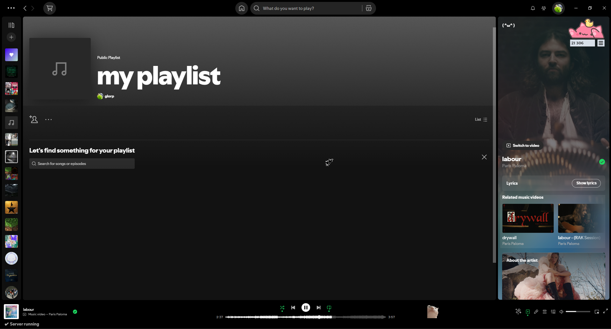
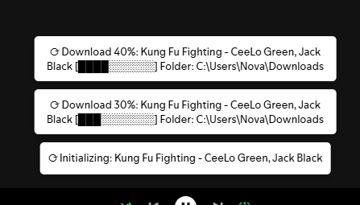

# Spotify Downloader

  

**Spotify Downloader** is a custom Spotify client extension that allows you to download tracks directly from Spotify using a local server. This tool integrates with **Spicetify**, providing a seamless way to save music while maintaining the Spotify experience.

---

## Features

- Download individual tracks directly from Spotify.  
- Progress notifications with Unicode symbols:  
  - `✓ Download Started`  
  - `⟳ Download <percent>%`  
  - `↓ Download Complete`  
  - `✗ Download Failed`  
- Runs a local server using Python (`flask`) for handling downloads.  
- Automatic installation of required Python modules (`flask`, `requests`, `flask_cors`).  
- Adds a startup shortcut to run the downloader automatically.  
- Visual server status in Spotify’s bottom bar: `✔ Server running` / `✖ Server offline`.  

---

## Screenshots

**Spotify Downloader running**  

  

**Download notifications**  

  

**Server status in Spotify**  

  

---

## Installation

1. **Clone the repository**  

```bash
git clone https://github.com/yourusername/spotify-downloader.git
cd spotify-downloader
```

    Run the setup script

Make sure you have Python installed. Then run:

python setup_spicetify_downloader.py

This script will:

    Create the Spicetify Extensions folder if it doesn’t exist.

    Install required Python modules (flask, requests, flask_cors).

    Copy the downloader scripts into your Spicetify Extensions folder.

    Create a startup shortcut to run the downloader automatically.

    Apply the Spicetify changes.

Usage

    Open Spotify with Spicetify applied.

    Right-click any track and select Download from the context menu.

    The downloader server will handle the track, showing notifications:

✓ Download Started: <Track Name>
⟳ Download 50%: <Track Name>
↓ Download Complete: <Track Name>
✗ Download Failed

✔ Server running
✖ Server offline

Requirements

    Python 3.10+

    Spicetify installed and functional

    Windows OS (uses %LOCALAPPDATA% and %APPDATA% paths)

Contributing

Feel free to submit issues, pull requests, or feature suggestions. Make sure to keep scripts compatible with the latest Spotify & Spicetify versions.
